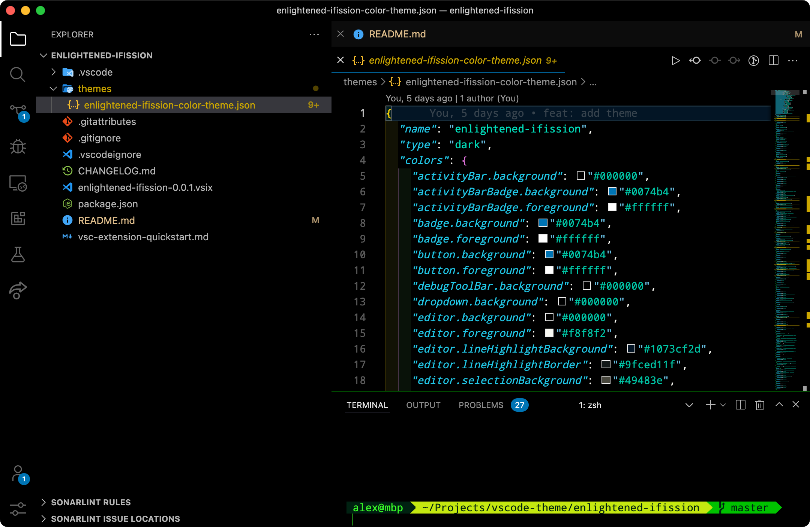
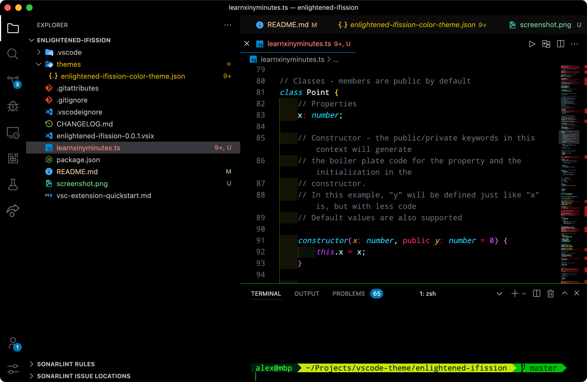
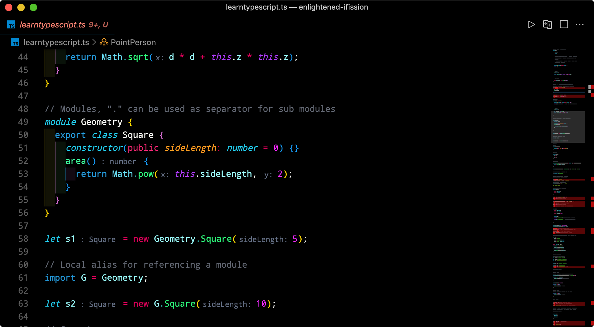

# README

enlightened theme ported from [Sublime Text](https://github.com/vincentmac/enlightened), with darker vscode background colours
built on top of [enlightenedTheme vscode](https://github.com/talesbaz/enlightenedTheme)

## screenshots

## change log
`0.0.1`
- initial release

`0.0.2`
- add colors for [inlay hints](https://devblogs.microsoft.com/python/python-in-visual-studio-code-july-2022-release/)
`0.03`
- change dropdown background (settings checkbox) from back to gray to improve visibility